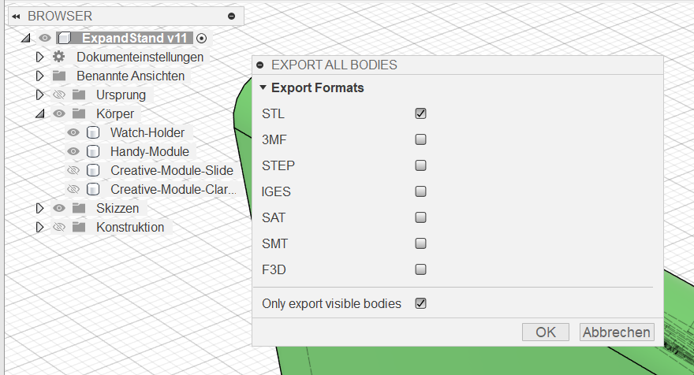
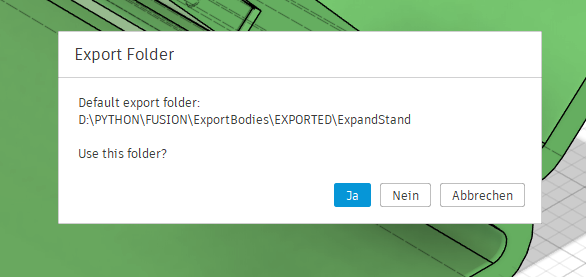
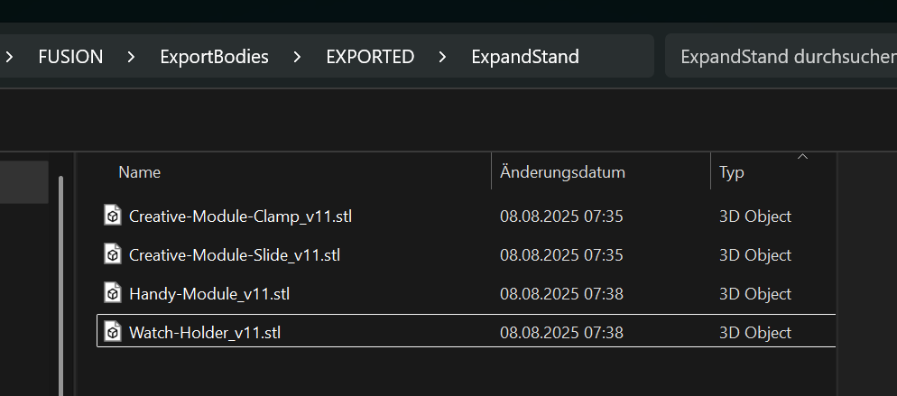

# 🔄 ExportBodies – Fusion 360 Add-In

**ExportBodies** is a Fusion 360 add-in that allows you to quickly and easily export all BRep bodies from the root component to multiple file formats at once – in a structured, repeatable workflow.

---

## 📦 Features

- ✅ Export **all visible bodies** in the root component
- ✅ Select multiple formats simultaneously (STL, STEP, IGES, 3MF, etc.)
- ✅ Supports versioned file naming (e.g. `Body_v2.stl`)
- ✅ Remembers last selected export formats
- ✅ Asks for export folder and creates per-document subfolder
- ✅ Cross-platform support (Windows & macOS)

---

## 📸 Screenshots

### Export-Dialog

### Exportiertes Ergebnis im Dateisystem

### Beispiel eines STL-Exports

---

## 🛠️ Installation

1. Clone or download this repository.

2. Move the entire `ExportBodies` folder to your Fusion 360 Add-Ins directory:

   - **Windows**  
     `C:\Users\<YourUsername>\AppData\Roaming\Autodesk\Autodesk Fusion 360\API\AddIns\`

   - **macOS**  
     `~/Library/Application Support/Autodesk/Autodesk Fusion 360/API/AddIns/`

3. Launch Fusion 360.

4. Open the **Scripts and Add-Ins** dialog:  
   `Tools` → `Add-Ins` → `Scripts and Add-Ins`

5. Switch to the **Add-Ins** tab, find **ExportBodies** in the list.

6. Click **Run** and optionally **Run on Startup**.

---

## 🧰 How to Use

1. Go to the **Tools** tab in Fusion 360.

2. Click the **ExportBodies** button in the custom panel.

3. Select one or more export formats from the dialog.

4. Confirm or choose your desired export folder.

5. Click **OK** – your bodies will be exported automatically!

---

## 📁 Output Folder Structure

Exports are saved to an `EXPORT` folder located **two levels above** the add-in directory.  
Each Fusion document gets its own subfolder:

