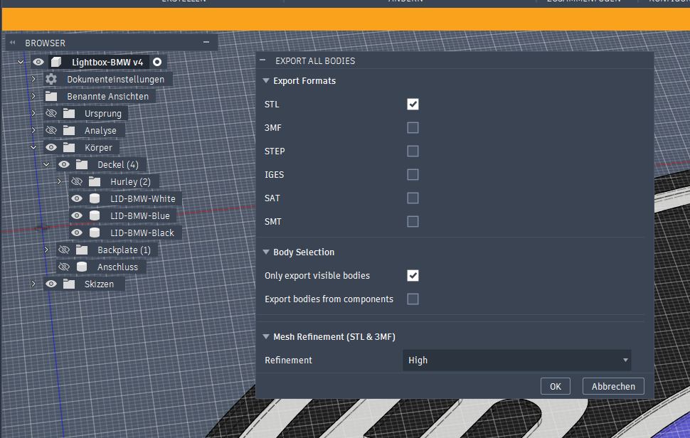
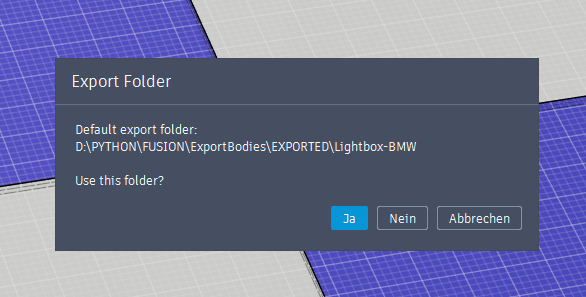

# 🔄 ExportBodies – Fusion 360 Add-In

**ExportBodies** is a Fusion 360 add-in that allows you to quickly and easily export all BRep bodies from the root component (and optionally from sub-components) to multiple file formats at once – in a structured, repeatable workflow.

---

## 📦 Features

- ✅ Export **all visible bodies** in the root component
- ✅ Optional: export bodies from **all sub-components**
- ✅ Select multiple formats simultaneously: **STL, 3MF, STEP, IGES, SAT, SMT**
- ✅ **Versioned file naming** based on the document name (e.g. `Body_v2.stl`)
- ✅ Remembers last selected **export formats and mesh settings**
- ✅ Suggests an export folder automatically – with option to choose a custom one
- ✅ Creates a **per-document subfolder** automatically
- ✅ **Mesh refinement** for STL & 3MF: Low / Medium / High / Custom
- ✅ In **Custom mode**: manually set Surface Deviation, Normal Deviation, Max Edge Length & Aspect Ratio
- ✅ Hidden bodies are **temporarily shown** for export and restored afterwards
- ✅ Optionally **opens the export folder** when done
- ✅ Cross-platform support: **Windows & macOS**

---

## � Screenshots

### Export Dialog


### Exported Files in Folder


### Example STL Export


---

## 🛠️ Installation

1. Clone or download this repository.

2. Move the entire `ExportBodies` folder to your Fusion 360 Add-Ins directory:

   - **Windows**  
     `C:\Users\<YourUsername>\AppData\Roaming\Autodesk\Autodesk Fusion 360\API\AddIns\`

   - **macOS**  
     `~/Library/Application Support/Autodesk/Autodesk Fusion 360/API/AddIns/`

3. Launch Fusion 360.

4. Open the **Scripts and Add-Ins** dialog:  
   `Tools` → `Add-Ins` → `Scripts and Add-Ins`

5. Switch to the **Add-Ins** tab, find **ExportBodies** in the list.

6. Click **Run** and optionally enable **Run on Startup**.

---

## 🧰 How to Use

1. Go to the **Solid** tab in Fusion 360 and click the **Export Bodies** button in the panel.

2. Select one or more **export formats** using the checkboxes.

3. Configure optional settings:
   - **Only export visible bodies** – skip hidden bodies
   - **Export bodies from components** – include bodies from sub-components
   - **Mesh Refinement (STL & 3MF)** – choose quality: `Low`, `Medium`, `High`, or `Custom`
     - `Custom` reveals additional fields: `Surface Deviation`, `Normal Deviation`, `Max Edge Length`, `Aspect Ratio`

4. Confirm the suggested export folder or choose a custom one.

5. Click **OK** – all bodies are exported automatically.

6. After export: optionally **open the folder** directly.

---

## 📁 Output Folder Structure

Exports are saved to an `EXPORTED` folder located **two levels above** the add-in directory.  
Each Fusion document gets its own subfolder:

```
EXPORTED/
└── MyProject/
    ├── Body1_v3.stl
    ├── Body1_v3.3mf
    ├── Body2_v3.stl
    └── ...
```

When exporting from sub-components, file names are composed of **component name + body name**:

```
EXPORTED/
└── MyProject/
    ├── Root_Body1_v1.stl
    ├── Housing_Body1_v1.stl
    └── Cover_Body2_v1.stl
```

---

## ⚙️ Supported Formats

| Format | Description                          |
|--------|--------------------------------------|
| STL    | Mesh (configurable refinement)       |
| 3MF    | Mesh with colors & metadata          |
| STEP   | Parametric CAD exchange format       |
| IGES   | Classic CAD exchange format          |
| SAT    | ACIS solid format                    |
| SMT    | Autodesk Shape Manager format        |

---

## 🗂️ Project Structure

```
ExportBodies/
├── commands/
│   └── Export/
│       ├── entry.py           # Main logic: dialog & export
│       ├── resources/         # Add-in icons
│       └── last_export_config.txt  # Saved format & mesh settings (auto-generated)
├── lib/
│   └── fusionAddInUtils/      # Utility functions (event handling, logging)
├── config.py                  # Configuration (panel name, IDs, etc.)
├── ExportBodies.py            # Add-in entry point
└── ExportBodies.manifest      # Add-in manifest
```

---

## 📝 License

This project is licensed under the [MIT License](LICENSE).
